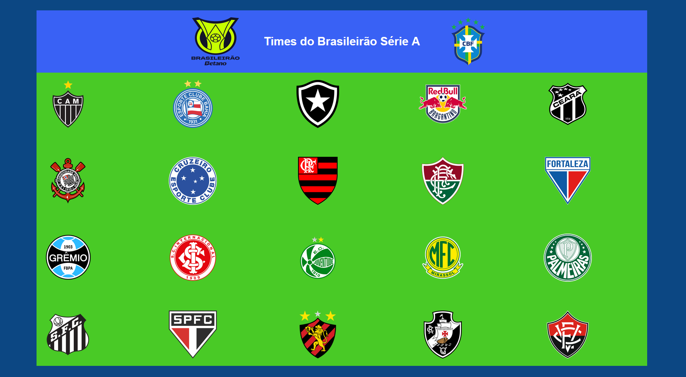

# Fute-Pédia!

## A Enciclopédia do futebol Nacional e Internacional

link para acessar --> https://lucasoliveira002.github.io/fute-pedia/

---
### Ideia:

O projeto tem a premissa de compartilhar campeonatos, clubes, seleções de futebol para todos os amantes do esporte, aqui você tem uma alta chance de encontrar algum desconhecido ou alguma curiosidade de algum time.

Pretendo fazer com que esse projeto se assemelhe a folhear um álbum de figurinhas, acho que deve ficar bem legal. Outro objetivo disso aqui é treinar a programação com JavaScript.

---

### Futuros upgrades
- Implementar todas as divisões nacionais faltantes (séries B, C e D);
- Implementar times das principais ligas europeias (Premier, LaLiga, Serie A, Ligue One, Liga Portugal etc);
- Implementar todos os times paulistas, pelo menos os que estão na A1 e A2;
- Criar uma página personalizada para cada clube.

Por enquanto acho que isso é o principal

--- 

### Status
Em Andamento...

---
### Avisos
O repositório ficará público, só pra poder hospedar por meio do github pages, mas se você quiser colaborar com o projeto sinta se a vontade para dar um fork e um pull request.

É muito time de futebol kkkkkkk