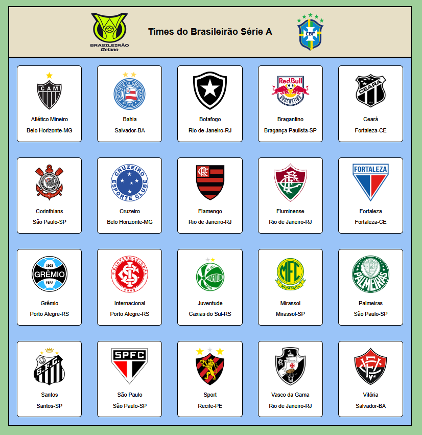
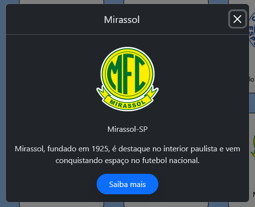
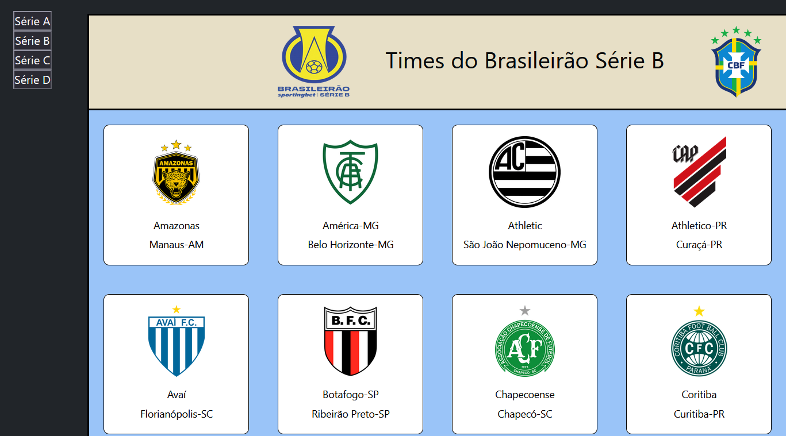
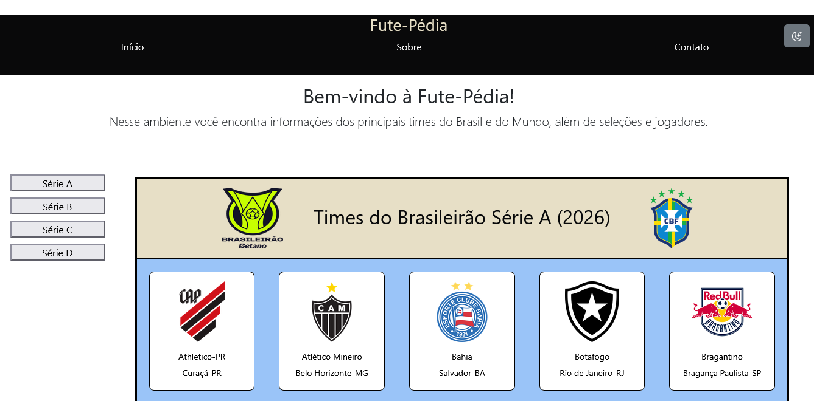
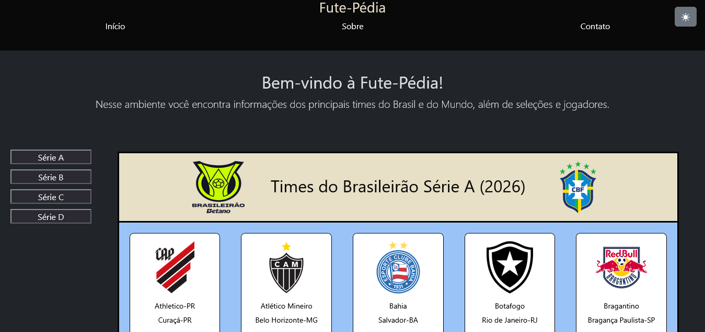

# Fute-Pédia!

## A Enciclopédia do futebol Nacional e Internacional

link para acessar --> https://fute-pedia.netlify.app/

---
### Ideia:

O projeto tem a premissa de compartilhar campeonatos, clubes, seleções de futebol para todos os amantes do esporte, aqui você tem uma alta chance de encontrar algum desconhecido ou alguma curiosidade de algum time.

Pretendo fazer com que esse projeto se assemelhe a folhear um álbum de figurinhas, acho que deve ficar bem legal. Outro objetivo disso aqui é treinar a programação com JavaScript.

---

### Funcionalidades
- Ao clicar num dos clubes abre uma caixinha com informações sobre

| | |
|---|---|
|  |  |

- Botão de navegação entre as 4 divisões com JavaScript

- Modo claro e escuro.

| | |
|---|---|
|  |  |
---
### Futuros possíveis upgrades
- Implementar times das principais ligas europeias (Premier, LaLiga, Serie A, Ligue One, Liga Portugal etc);
- Implementar todos os times paulistas, pelo menos os que estão na A1 e A2;
- Criar uma página personalizada para cada clube. (Talvez)
- Sistema de Login (cadastro) - Descontinuado
- Usuário poder rankear clubes arrastando

Por enquanto acho que isso é o principal

--- 

### Status
Em Andamento...

---
### Avisos
- O programa apresenta mal funcionamento, se caso, for tentar rodar apenas no clicando no arquivo da pasta. Por algum motivo que eu não sei, só funciona de forma ideal se rodado no LiveServer.
- Alguns clubes podem não mostrar o escudo se clicado, isso se deve pela maioria das imagens serem puxadas por links externos.
- A série D está inviável de atualizar

---
### Atualizações
- os times nos campeonatos são exibidos agora por ano

---

#### Ficha Técnica
- O projeto faz uso de Bootstrap, JavaScript, HTML e CSS
- Está hospedado na plataforma do Netlify
